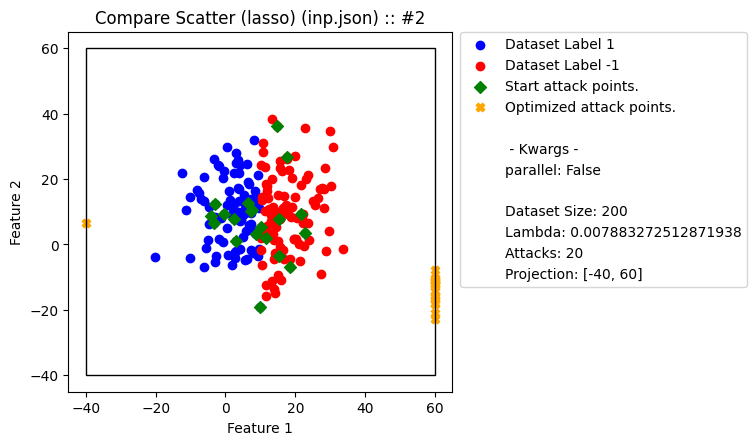
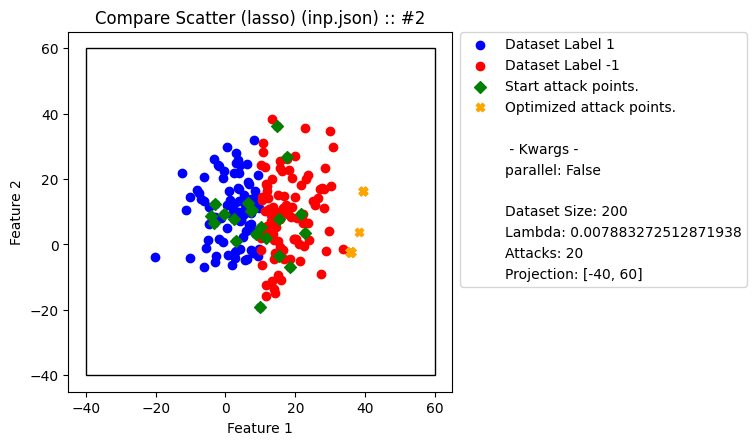

# Dataset Poisoning

##### Poisoning datasets using gradient ascent, targeting feature selection.

##### [Documentation](https://rpgolota.github.io/poisoning/build/html/index.html)

| Tests |Description|
| ----------- | ----------- |
||Tests regarding algorithm.|
||Tests regarding the ability to build and install with pip|

---

### Examples
The following is an example of using xiao2018 to poison a gaussian distribution.



The following is an example of using frederickson2018 to poison a gaussian distribution.



### Get started
```python
import pandas as pd
from poisoning import xiao2018

dataset = pd.read_csv('spect_test.csv', sep=",", header=None)

X = dataset.iloc[:,:-1].values
Y = dataset.iloc[:,-1].values

model = xiao2018(type='elastic')
# poison 10 percent of the dataset, with a boundary box of 0 to 2 for all features
poisoned, labels = model.autorun(X, Y, 0.1, (0,2))
```

##### Windows
If you are on windows, make sure to use a name guard if multiprocessing is enabled (default),

```python
if __name__ == '__main__':
    model = xiao2018()
    ...
```
or disable multiprocessing altogether.
```python
model = xiao2018(parallel=False)
...
```
